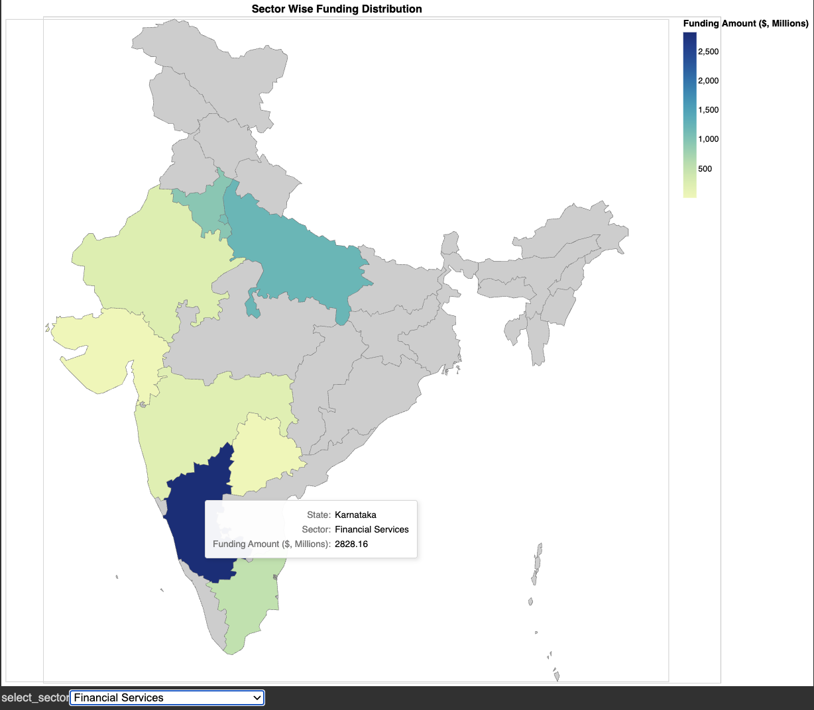

TLDR; EDA File -> `the_eda_notebook.ipynb`

## About The Project

Creating a startup is a challenging and exciting endevour. There is so little time to do things that you want to maximize on every step. Especially funding. So we wanted to look at the stature of funding startups in our Home Country: India, and see how it can help an entrepreneure or a VC Fund manager to interact with the market in a more informed manner.

## Dataset

We source our data from 2 Kaggle datasets:
1. [Indian Startups In 2022 - Kaggle](https://www.kaggle.com/datasets/omkargowda/indian-startups-funding-data-januarymay-2022) - The dataset contains datapoints about fundings that various startup in India received for Jan 2022 to May 2022. There are a total of 5 csv files, one for each month.
2. [Indian Startups In 2021 - Kaggle](https://www.kaggle.com/datasets/ramjasmaurya/indian-startupsin-2021) - 
The dataset contains datapoints about fundings that various startup in India received for the year 2021. This year about one thousand successful startup fundings that took place. All the data for this one year is combined into one file that can be loaded onto pandas directly for analysis.

For maps related datafile we use shapefiles as provided openly here: https://github.com/Princenihith/Maps_with_python

For city to state mapping we use openly available JSON data here: https://github.com/nshntarora/Indian-Cities-JSON/blob/master/cities.json which we further add to to need our purpose and can be found in our repo ./dataset/cities.json (we have raised a pull request to the author with our additions but the repo seems to be inactive so pasting a copy here for our purposes)

## Prerequisites

A few packages that we expect installed - `geopandas` `simpledbf`

## Installation

No installation necessary! Just open it on Google Colab and you are ready to go!

## Usage

Because most of our graphs are made on Altair, they will most probably be intractable. Do hover and click here and there to see what happens.
Don't worry we give out hints too.

## Contributing

Contributions are what make the open source community such an amazing place to learn, inspire, and create. Any contributions you make are **greatly appreciated**.

If you have a suggestion that would make this better, please fork the repo and create a pull request. You can also simply open an issue with the tag "enhancement".
Don't forget to give the project a star! Thanks again!

1. Fork the Project
2. Create your Feature Branch (`git checkout -b feature/AmazingFeature`)
3. Commit your Changes (`git commit -m 'Add some AmazingFeature'`)
4. Push to the Branch (`git push origin feature/AmazingFeature`)
5. Open a Pull Request

## Current Owners:

Yashash Gaurav - [Twitter](https://twitter.com/yashashgaurav) | [LinkedIn](https://www.linkedin.com/in/yashashgaurav/)\
Siddharth Sai - [LinkedIn](https://www.linkedin.com/in/siddharthsai/)

## Acknowledgments

Thanking [Prof. Raja](https://www.heinz.cmu.edu/faculty-research/profiles/sooriamurthi-raja) for encouraging us to meet deadline and present our findings on this dataset.

